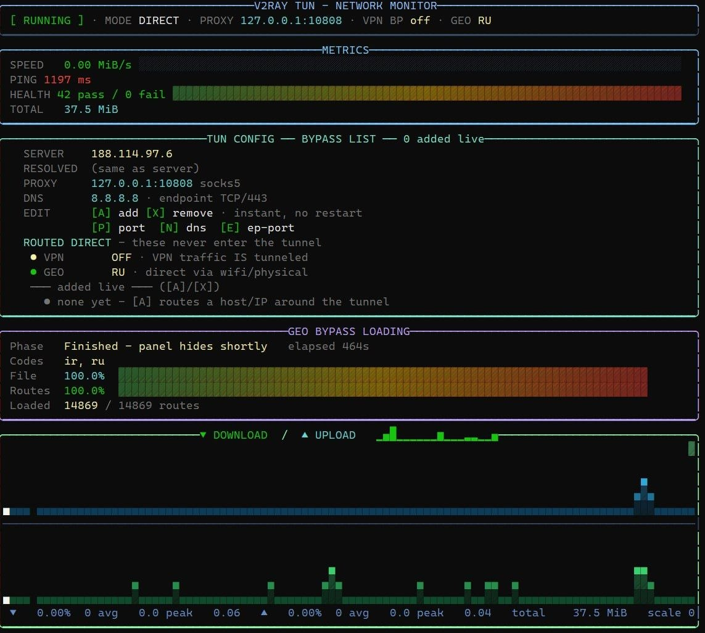
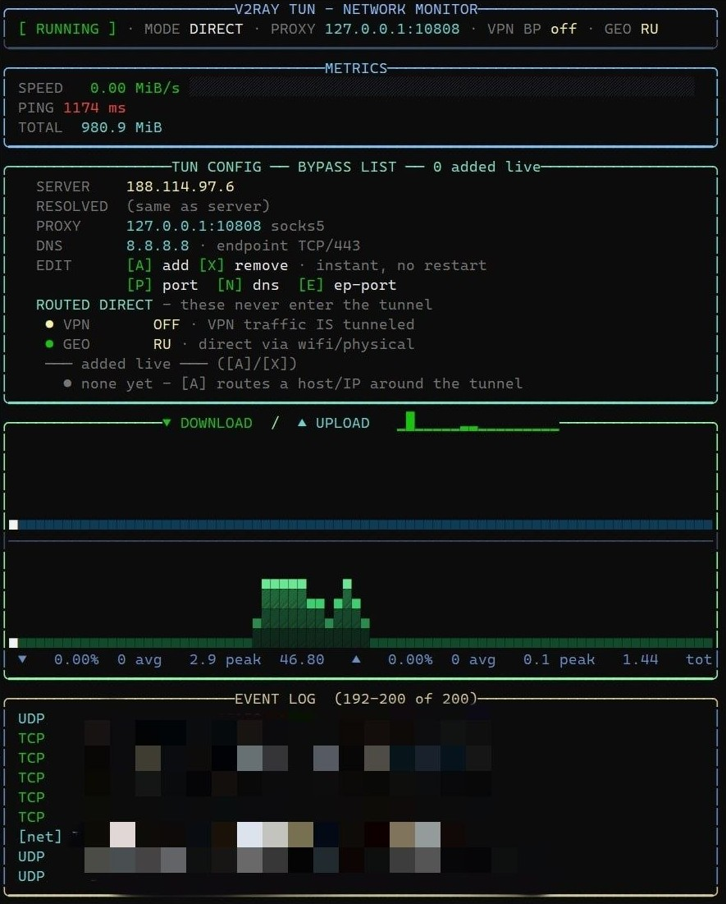
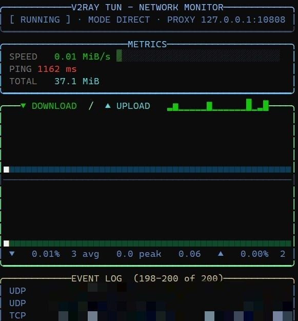
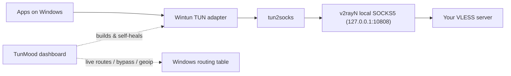

# TunMood

[](https://github.com/kooshaZP/TunTop/actions)
[](https://github.com/kooshaZP/TunTop/blob/main/LICENSE)
[](#requirements)
[](#requirements)
[](#-files)

**Route all of your Windows traffic through any VLESS proxy — and watch it happen live in a btop-style dashboard.**

TunMood drives a Wintun TUN adapter from your v2rayN (VLESS) proxy so every app on the PC is tunneled, not just the browser: throughput graphs, a ~30-probe health suite, instant bypass add/remove, geoip country splitting, profiles, leak tests, and one-key diagnostics — all with **zero pip dependencies**.

> ⚠️ The dashboard builds and owns the tunnel itself. Never run `tunmood/helper.py` directly — always launch through `Run_Helper.ps1` or `tunmood/dashboard.py`.

<p align="center">
  <br>
  
  
  
</p>


## Contents

- [Why TunMood](#-why-tunmood)
- [Features](#-features)
- [How it works](#-how-it-works)
- [Quick start](#-quick-start)
- [Requirements](#requirements)
- [Key reference](#️-key-reference)
- [Project layout](#-project-layout)
- [Tests](#-tests)
- [Troubleshooting](#-troubleshooting)
- [Contributing](#-contributing)
- [Acknowledgments](#-acknowledgments)
- [License](#-license)

## 🤔 Why TunMood

Most VLESS/v2ray setups only proxy the browser, and checking whether the tunnel is actually healthy usually means squinting at a log file. TunMood takes a different approach:

- **System-wide by default** — a real TUN adapter means every process is tunneled, not just apps that support a SOCKS/HTTP proxy setting.
- **You can see it working** — a live dashboard instead of a blank terminal window, so a dead tunnel is obvious at a glance instead of discovered mid-download.
- **No install footprint** — pure Python stdlib plus two auto-downloaded binaries (`tun2socks.exe`, `wintun.dll`); nothing touches `pip`.
- **Safe to poke at** — routes can be added, removed, or re-applied live, and teardown is verified rather than assumed.

## ✨ Features

**Tunnel & routing**
- Full-tunnel routing via Wintun + tun2socks (IPv4 *and* IPv6), with VPN-proof split defaults
- Geo bypass — route a whole country direct from `geoip.dat`, re-appliable live with `[R]`
- Instant bypass add/remove (`[A]`/`[X]`) — installs/deletes `/32` + `/128` routes from a background thread while the tunnel keeps running

**Dashboard & monitoring**
- Live btop-style UI: gradient area/line/braille throughput graphs, metric cards, mouse support, 7 color themes
- Health-check suite with ~30 probes (`[C]`)
- Leak test `[L]` — compares direct vs. tunneled exit IPs to prove the tunnel is actually doing something
- Colored event log and one-key diagnostics export (`[D]`) — config, routes, logs, and last scan in a single file

**Live configuration**
- Edit everything at runtime with no restart required: servers `[U]`, VPN mode `[V]`, VPN bypass `[Y]`, geo config `[F]`, SOCKS port `[P]`, DNS `[N]`, endpoint port `[E]`
- Profiles — save and load complete setups with `[O]` / `[I]`

**Reliability**
- Self-healing helper that monitors the tunnel and re-applies routes/DNS on failure
- Clean teardown — quitting verifies the route table is actually clear before exiting

## 🏗️ How it works



`Run_Helper.ps1` launches the dashboard, which builds a Wintun adapter and feeds it through `tun2socks` into v2rayN's local SOCKS5 inbound. From there your VLESS server carries the traffic. The dashboard owns that tunnel for its whole lifetime — editing servers, bypass rules, or geoip splits updates the Windows routing table live instead of tearing everything down and starting over.

## 🚀 Quick start

1. **Get the repo**
   ```powershell
   git clone https://github.com/kooshaZP/TunTop.git
   cd TunTop
   ```
2. **Set up v2rayN** — install [v2rayN](https://github.com/2dust/v2rayN), add your VLESS server, and enable the local SOCKS inbound (default `127.0.0.1:10808`).
3. **Run the launcher**
   ```powershell
   powershell -ExecutionPolicy Bypass -File Run_Helper.ps1
   ```
   or right-click `Run_Helper.ps1` → *Run with PowerShell* → confirm the UAC prompt. First run auto-downloads `tun2socks.exe` and `wintun.dll` if they're missing.
4. **Pick your setup** — choose VPN mode, glyph mode, and geo bypass in the menus; the dashboard starts automatically.
5. **Verify it** — press `[C]` inside the dashboard to run the health scan, or `[L]` for a leak test.

### Requirements

| What                  | Why                         |
| --------------------- | ---------------------------- |
| Windows 10 1803+ / 11 | `curl.exe`, Wintun            |
| Python 3.10+          | stdlib only, no `pip install` |
| Administrator         | route table management        |
| v2rayN running        | provides the SOCKS5 inbound    |

## ⌨️ Key reference

| Key                           | Action                                               |
| ------------------------------ | ----------------------------------------------------- |
| `[C]` / `[S]` / `[T]` / `[Q]` | Health scan / start / stop / quit (verifies cleanup)   |
| `[A]` / `[X]`                 | Add/remove bypass **instantly** (no tunnel restart)    |
| `[B]` `[Z]`                   | Bypass panel · legacy restart-mode toggle              |
| `[L]` `[D]`                   | Leak test · export diagnostics                         |
| `[O]` `[I]`                   | Save / load profile                                    |
| `[U]` `[V]` `[Y]` `[F]`       | Servers · VPN mode · VPN bypass · geo config            |
| `[P]` `[N]` `[E]`             | SOCKS port · DNS · endpoint port                        |
| `[R]`                          | Re-apply geoip country bypass live                      |
| `[G]` `[M]` `[H]`             | Graph mode · theme · hide help                          |
| `1–6`, `0`                    | Hide/show panels                                        |

## 📁 Project layout

```
Run_Helper.ps1            <- launcher + one-click installer (PowerShell)
tunmood/
  dashboard.py             <- the btop-style dashboard (owns the tunnel)
  helper.py                <- tunnel builder + self-heal monitor
  routing.py                <- netsh/PowerShell route engine (add/delete/verify)
  netdns.py                <- resolver: cache, UDP/53 + DoH fallbacks
  geoip.py                  <- geoip.dat / JSON country-range parser
profiles.json              <- created when you save profiles
test_bypass_resolve.py      <- offline test suite (~70 checks)
```

`tun2socks.exe` and `wintun.dll` are auto-downloaded on first run and are not checked into the repo.

## 🧪 Tests

```powershell
python test_bypass_resolve.py        # fully offline, mocked DNS/routes
python test_bypass_resolve.py --live # adds real DNS lookups
```

The suite is offline-by-default and runs in roughly 25 seconds — run it before every commit.

## 🩺 Troubleshooting

- **Dashboard won't start / UAC prompt fails** — TunMood needs Administrator rights to manage the route table. Re-run `Run_Helper.ps1` as Administrator.
- **Health scan reports a failing probe** — press `[D]` to export diagnostics (config, routes, logs, last scan) before digging further; it's the fastest way to see what the scan actually saw.
- **Traffic isn't going through the tunnel** — run a leak test with `[L]` to compare your direct vs. tunneled exit IP, and confirm v2rayN's SOCKS5 inbound is actually listening on the port TunMood is pointed at (`[P]`).
- **Running alongside another VPN** — use VPN mode (`[V]`) and VPN bypass (`[Y]`) so TunMood's own connection can ride the existing VPN instead of fighting it for the default route.
- **Still stuck?** Open an issue and attach the diagnostics file from `[D]` — see [Contributing](#-contributing).

## 🤝 Contributing

See [CONTRIBUTING.md](https://github.com/kooshaZP/TunTop/blob/main/CONTRIBUTING.md) for the full guide. The short version:

- **Standard library only** — no new pip dependencies without discussing them in an issue first.
- **The UI must never block** — DNS, PowerShell, and route operations belong on background threads.
- **Cleanup is sacred** — anything that adds routes must be removable at exit, even if the helper child is force-killed.
- Run both test suites before committing, and include a `diagnostics_[...].txt` (`[D]`) with any bug report.

## 🙏 Acknowledgments

TunMood builds on top of:

- [v2rayN](https://github.com/2dust/v2rayN) for the VLESS client and local SOCKS5 inbound
- [tun2socks](https://github.com/xjasonlyu/tun2socks) for TUN-to-SOCKS translation
- [Wintun](https://www.wintun.net/) for the Windows TUN adapter driver
- [btop](https://github.com/aristocratos/btop) for the dashboard's visual inspiration

## 📄 License

[MIT](https://github.com/kooshaZP/TunTop/blob/main/LICENSE)
