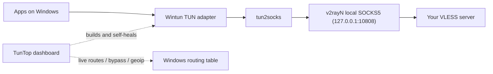

# TunTop

[](https://github.com/kooshaZP/TunTop/actions)
[](https://github.com/kooshaZP/TunTop/blob/main/LICENSE)
[](#requirements)
[](#requirements)
[](#features)

**A Windows full-tunnel for VLESS.**

v2rayN gives you the proxy. TunTop gives you system-wide routing.

<p align="center">
  <br>
  
  
</p>

## Features

- IPv4 and IPv6 full-tunnel routing via Wintun + tun2socks
- DNS leak protection with UDP/53 and DoH fallback
- Kill-safe cleanup — verified teardown on every exit
- Live bypass add/remove without restarting the tunnel
- Geo-IP country routing from `geoip.dat`
- Health monitoring with ~30 probes
- Self-healing — auto-restarts on tunnel failure
- btop-style dashboard with throughput graphs, 7 color themes
- Leak test, diagnostics export, profiles
- Zero pip dependencies

## Why do I need this?

Most VLESS/v2ray setups only proxy the browser. TunTop routes **every app** on your PC through your VLESS server — system-wide — and shows you exactly what's happening in a live dashboard. A dead tunnel is obvious at a glance instead of discovered mid-download.

## Quick start (30 seconds)

### 1. Clone

```powershell
git clone https://github.com/kooshaZP/TunTop.git
cd TunTop
```

### 2. Set up v2rayN

Install [v2rayN](https://github.com/2dust/v2rayN), add your VLESS server, and enable the local SOCKS inbound (default `127.0.0.1:10808`).

### 3. Run

```powershell
powershell -ExecutionPolicy Bypass -File Run_Helper.ps1
```

Right-click `Run_Helper.ps1` → **Run with PowerShell** → confirm the UAC prompt. First run auto-downloads `tun2socks.exe` and `wintun.dll` if they're missing.

Press **[S]** to start the tunnel, **[C]** to run a health scan, **[L]** for a leak test.

## How it works



TunTop builds a Wintun TUN adapter, feeds it through `tun2socks` into v2rayN's local SOCKS5 inbound, and manages the Windows routing table to direct all traffic through it. The dashboard owns the tunnel for its entire lifetime — editing servers, bypass rules, or geo splits updates the routing table live.

## Key reference

| Key                           | Action                                               |
| ------------------------------ | ----------------------------------------------------- |
| `[S]` `[T]` `[Q]`             | Start / stop / quit (verifies cleanup)                |
| `[C]`                         | Health scan                                           |
| `[A]` `[X]`                   | Add/remove bypass instantly (no restart)              |
| `[L]` `[D]`                   | Leak test / export diagnostics                        |
| `[O]` `[I]`                   | Save / load profile                                   |
| `[U]` `[V]` `[Y]` `[F]`       | Servers / VPN mode / VPN bypass / geo config          |
| `[P]` `[N]` `[E]`             | SOCKS port / DNS / endpoint port                      |
| `[R]`                         | Re-apply geoip country bypass live                    |
| `[G]` `[M]` `[H]`             | Graph mode / theme / hide help                        |
| `1-6`, `0`                    | Hide/show panels                                      |

## Requirements

| What                  | Why                         |
| --------------------- | ---------------------------- |
| Windows 10 1803+ / 11 | Wintun adapter driver         |
| Python 3.10+          | stdlib only, no pip install   |
| Administrator         | route table management        |
| v2rayN running        | provides the SOCKS5 inbound   |

## Project layout

```
Run_Helper.ps1            <- launcher (PowerShell)
tuntop/
  dashboard.py             <- btop-style dashboard (owns the tunnel)
  helper.py                <- tunnel builder + self-heal monitor
  routing.py               <- netsh/PowerShell route engine
  netdns.py                <- DNS resolver with cache
  geoip.py                 <- geoip.dat country-range parser
  state.py                 <- tunnel state machine
  recovery.py              <- backoff-based recovery engine
  routes_txn.py            <- transactional route management
  startup_recovery.py      <- crash detection + cleanup at launch
  integrity.py             <- binary SHA-256 verification
  ui_text.py               <- terminal text/layout primitives
  profiles.py              <- profile save/load
tests/                     <- 164 tests across 5 tiers
```

`tun2socks.exe` and `wintun.dll` are auto-downloaded on first run and not in the repo.

## Troubleshooting

- **Dashboard won't start** — TunTop needs Administrator rights. Right-click `Run_Helper.ps1` → Run as Administrator.
- **Health scan fails** — press `[D]` to export diagnostics (config, routes, logs, last scan) and attach it to an issue.
- **Traffic leaks** — run `[L]` to compare direct vs tunneled exit IP, and confirm v2rayN's SOCKS5 inbound is listening on the port TunTop uses (`[P]`).
- **Running alongside another VPN** — use VPN mode (`[V]`) and VPN bypass (`[Y]`) so TunTop rides the existing VPN instead of fighting for the default route.
- **Still stuck?** Open an issue and attach the diagnostics file from `[D]`. See also [FAQ](FAQ.md).

## Tests

164 pure-stdlib tests across 5 tiers, runnable on any OS with no admin rights:

```bash
# Run the full suite (what CI runs)
python -m unittest discover -s tests -t . -v

# Including live-network tests (needs Internet)
TUNTOP_NET_TESTS=1 python -m unittest discover -s tests -t . -v
```

See `tests/README.md` for the tier layout (unit / routing / recovery / integration / network).

## Contributing

See [CONTRIBUTING.md](https://github.com/kooshaZP/TunTop/blob/main/CONTRIBUTING.md). Short version:

- **Standard library only** — no new pip dependencies without discussing in an issue.
- **The UI must never block** — DNS, PowerShell, and route operations belong on background threads.
- **Cleanup is sacred** — anything that adds routes must be removable at exit.
- Run tests before committing. Include diagnostics (`[D]`) with bug reports.

## Acknowledgments

TunTop builds on:

- [v2rayN](https://github.com/2dust/v2rayN) — VLESS client and SOCKS5 inbound
- [tun2socks](https://github.com/xjasonlyu/tun2socks) — TUN-to-SOCKS translation
- [Wintun](https://www.wintun.net/) — Windows TUN adapter driver
- [btop](https://github.com/aristocratos/btop) — dashboard visual inspiration

## License

[MIT](https://github.com/kooshaZP/TunTop/blob/main/LICENSE)
