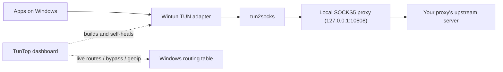

# TunTop

[](https://github.com/kooshaZP/TunTop/actions)
[](https://github.com/kooshaZP/TunTop/blob/main/LICENSE)
[](#requirements)
[](#requirements)
[](#features)

## Topics

`windows` · `vpn` · `proxy` · `socks5` · `tun2socks` · `wintun` · `full-tunnel` · `v2rayn` · `xray` · `sing-box` · `clash` · `vless` · `vmess` · `trojan` · `shadowsocks` · `geoip` · `dns-leak-protection` · `tui` · `dashboard` · `network-monitor` · `routing` · `privacy` · `censorship-circumvention` · `python`


**A Windows full-tunnel for any SOCKS5 proxy.**

v2rayN, Xray, sing-box, Clash Meta — any proxy client with a local SOCKS5 inbound works. TunTop gives you system-wide routing.

<p align="center">
  <br>
  
  
</p>

## Features

- IPv4 and IPv6 full-tunnel routing via Wintun + tun2socks
- DNS leak protection with UDP/53 and DoH fallback
- Kill-safe cleanup — verified teardown on every exit
- Live bypass add/remove without restarting the tunnel
- Geo-IP country routing from `geoip.dat`
- Health monitoring with ~30 probes
- Self-healing — auto-restarts on tunnel failure
- btop-style dashboard with throughput graphs, 7 color themes
- Leak test, diagnostics export, profiles
- Zero pip dependencies

## Why do I need this?

Most proxy setups only cover the browser. TunTop routes **every app** on your PC through your proxy — system-wide — and shows you exactly what's happening in a live dashboard. A dead tunnel is obvious at a glance instead of discovered mid-download.

## Quick start (30 seconds)

### 1. Clone

```powershell
git clone https://github.com/kooshaZP/TunTop.git
cd TunTop
```

### 2. Set up a proxy client

Install any SOCKS5-capable proxy client — e.g. [v2rayN](https://github.com/2dust/v2rayN), Xray, sing-box, or Clash Meta — and enable its local SOCKS inbound (default `127.0.0.1:10808`).

### 3. Set the server (the proxy origin)

TunTop also needs the address of your proxy's **origin server** — the remote
server your local proxy client (v2rayN, Xray, sing-box, ...) connects to.

**The protocol does not matter.** VLESS, VMess, Trojan, Shadowsocks, naive,
Reality, WS/gRPC transports — TunTop never talks to that server and never sees
your client's config. The only thing it consumes is the local SOCKS5 inbound
your client exposes; the origin address is needed for exactly one purpose: it
is the one address that must **NOT** go through the tunnel itself. TunTop
routes it around the TUN automatically, but you have to tell it where the
origin is. Pick **one** of these ways:

- **Edit `Run_Helper.ps1`** — set the `$Servers` line near the top:

  ```powershell
  $Servers = @('203.0.113.10')                    # a bare IP
  # $Servers = @('example.com')                   # or a hostname
  # $Servers = @('a.example.com', 'b.example.com') # multiple are fine
  ```

- **Command line** — `--server` is repeatable:

  ```powershell
  python tuntop/ui/dashboard.py --server 203.0.113.10 --server example.com
  ```

- **Live in the dashboard** — press `[U]` (Servers) and type the address(es),
  comma or space separated — or ADD them to the existing list. **A full share
  link works too**: pasting something like `vless://uuid@203.0.113.10:443?type=ws...`,
  `trojan://...`, `ss://...` or `https://example.com/...` is fine — TunTop
  strips the scheme, UUID/userinfo, port and path and keeps only the host,
  whatever the protocol. Changes made with `[U]` are resolved immediately and
  take effect on the next tunnel start (`[S]`).

**Why the origin never goes through the TUN:** for every address you list,
TunTop resolves it (both IPv4 and IPv6) and installs explicit host routes
(`/32` for IPv4, `/128` for IPv6) through the **physical NIC**. The tunnel's
own connection to the origin therefore always rides the real network and never
enters the TUN — otherwise the tunnel would try to reach its server through
itself (a routing loop) and nothing would connect. You can verify this in the
`[2]` panel: **SERVER / RESOLVED** on the *TUNNEL* side, and the same
addresses listed under **DIRECT** (what is routed around the tunnel).

> If your origin sits behind a CDN or reaches other domains, bypass those too:
> `--bypass-ip cdn.example.com` (repeatable) or press **[A]** in the dashboard
> and choose *direct* — same bypass mechanism, for any extra host.

### 4. Run

**Easiest — double-click `Start_TunTop.bat`.** It fixes the two classic
"downloaded from GitHub and it won't run" problems automatically (strips the
Mark-of-the-Web with `Unblock-File`, runs with `-ExecutionPolicy Bypass`),
styles the console (title, UTF-8, 120×36, TrueType font so the box glyphs
render), and starts `Run_Helper.ps1`.

> ⚠️ **Windows blocks `.ps1` scripts by default.** PowerShell's default
> execution policy is `Restricted`, and files downloaded from GitHub carry the
> Mark-of-the-Web, so double-clicking `Run_Helper.ps1` does nothing (or opens
> it in Notepad). Use **one** of these:
>
> - **`Start_TunTop.bat`** (recommended — fixes both blockers + styling)
> - **From a terminal** (also bypasses the policy):
>   ```powershell
>   powershell -ExecutionPolicy Bypass -File Run_Helper.ps1
>   ```
> - **From Explorer:** right-click `Run_Helper.ps1` → **Run with PowerShell**
>   → confirm the UAC prompt. (The script also unblocks itself and, if the
>   policy is `Restricted`, relaunches under `Bypass` on its own.)

Right-click `Run_Helper.ps1` → **Run with PowerShell** → confirm the UAC prompt. First run auto-downloads `tun2socks.exe` and `wintun.dll` if they're missing.

Press **[S]** to start the tunnel, **[C]** to run a health scan, **[L]** for a leak test.

### Running the standalone `TunTop.exe` (no Python needed)

1. **Download** `TunTop.exe` (and `checksums.txt`) from the
   [latest release](https://github.com/kooshaZP/TunTop/releases/latest) into any
   folder — `Desktop\TunTop\` for example. The exe already contains
   `tun2socks` and `wintun.dll`; nothing else is bundled, and Python is **not**
   required.
2. **(Optional) verify it:** `certutil -hashfile TunTop.exe SHA256` and compare
   with `checksums.txt`.
3. **Run it:** double-click `TunTop.exe` → confirm the **UAC prompt** (the
   dashboard manages routes and a TUN adapter, so admin is mandatory). A
   btop-style dashboard opens. Missing files are fetched automatically on
   first start (tun2socks / wintun if somehow absent, and the **geoip**
   database in the background — progress shows in the event log).
4. **Point it at your proxy** — the dashboard asks for a SOCKS5 inbound at
   `127.0.0.1:10808` (the v2rayN default). Start that proxy client first.
5. **Press `[S]`** — the tunnel comes up: Wintun adapter, routes, DNS. The
   header badge flips to **RUNNING**. Press **[C]** for a health scan and
   **[L]** for a leak test.

#### Changing servers and settings live (no restart)

The dashboard edits a RUNNING tunnel in place:

- **[U] Servers** — switch/add the proxy origin server live: pick from the list
  (arrow keys / mouse, Enter to apply), or replace / add addresses. The
  origin's protocol is irrelevant — only its host/IP is used.
- **[E] Endpoint** — change the endpoint port (e.g. 443) live.
- **[P] Port** — change the local SOCKS5 port live.
- **[N] DNS** — change the tunnel DNS servers live.
- **[A] / [X]** — add / remove a bypass IP instantly (route a site or server
  DIRECT, outside the tunnel) and choose the target: direct / proxy2 / VPN.
- **[F] Geo Manager** — country-level bypass: press **[W]** inside it to
  download/update the geoip database, then apply a country code (e.g. `cn`) so
  those sites route DIRECT while everything else stays in the tunnel.
- **[Z] Proxies** — add/change/remove a second proxy hop (proxy2) at runtime.
- **[V] / [Y]** — ride-another-VPN mode and its bypass list.
- **[O] / [I]** — save the whole setup to a profile / load it back.

Everything you change is logged in the event log panel (bottom). Press **[T]**
to stop the tunnel (routes are swept and verified), **[Q]** to quit.

> The exe requests the **Cascadia Mono SemiLight** font at startup so the
> box-drawing glyphs render. If your console ignores it and you see
> `???????????`, see [Troubleshooting](#troubleshooting) for the
> right-click → Properties → Font fix.

## How it works



TunTop builds a Wintun TUN adapter, feeds it through `tun2socks` into your proxy's local SOCKS5 inbound, and manages the Windows routing table to direct all traffic through it. The dashboard owns the tunnel for its entire lifetime — editing servers, bypass rules, or geo splits updates the routing table live.

## Key reference

| Key                           | Action                                               |
| ------------------------------ | ----------------------------------------------------- |
| `[S]` `[T]` `[Q]`             | Start / stop / quit (verifies cleanup)                |
| `[C]`                         | Health scan                                           |
| `[A]` `[X]`                   | Add/remove bypass instantly, with target choice: direct / proxy2 / vpn (no restart) |
| `[L]` `[D]`                   | Leak test / export diagnostics                        |
| `[O]` `[I]`                   | Save / load profile                                   |
| `[U]` `[V]` `[Y]` `[F]`       | Servers (live) / VPN mode / VPN bypass / geo manager (apply · change · remove, live) |
| `[Z]`                         | Add/change/remove the second proxy (proxy2) at runtime |
| `[P]` `[N]` `[E]`             | SOCKS port / DNS (live, no restart) / endpoint port (live) |
| `[R]`                         | Re-apply geoip country bypass live                    |
| `[G]` `[M]` `[H]`             | Graph mode / theme / help show-hide                   |
| `1-6`, `0`                    | Hide/show panels                                      |
| `j`/`k` / arrows / PgUp / wheel / ←→ | Scroll: hovering a panel makes it the ACTIVE target for j/k, arrows, PgUp/PgDn, Home/End, ←/→ and the wheel |

On short windows (16:9 screens) the panels shrink first — health-check rows,
then the graph — and the help footer is only removed as the last resort.

## Requirements

| What                  | Why                         |
| --------------------- | ---------------------------- |
| Windows 10 1803+ / 11 | Wintun adapter driver         |
| Python 3.10+          | stdlib only, no pip install   |
| Administrator         | route table management        |
| A SOCKS5 proxy client (v2rayN, Xray, sing-box, Clash Meta, ...) running locally | provides the SOCKS5 inbound |

## Project layout

```
Run_Helper.ps1            <- launcher (PowerShell)
tuntop/
  core/                    <- tunnel orchestration (UI only talks to this)
    tunnel_manager.py      <- lifecycle facade (start/stop/recover)
    state.py               <- tunnel state machine
    recovery.py            <- backoff-based recovery engine
    routes_txn.py          <- transactional route management
    startup_recovery.py    <- crash detection + cleanup at launch
    integrity.py           <- binary SHA-256 verification
    events.py              <- structured logging
  network/                 <- routing / DNS / VPN (Windows edge)
    routing.py             <- netsh/PowerShell route engine
    dns.py                 <- DNS resolver with cache
    vpn.py                 <- VPN detection / coexistence
  tunnel/                  <- Wintun + tun2socks (Windows edge)
    helper.py              <- tunnel builder + self-heal monitor
    wintun.py              <- Wintun adapter management
    tun2socks.py           <- tun2socks process management
  monitor/                 <- health / traffic / leak / diagnostics
    health.py              <- visual health report
    traffic.py             <- live traffic stats
  config/                  <- profiles + models + defaults
    profiles.py            <- profile save/load + protected secrets
  geo/                     <- geoip.dat parser
    geoip.py
  ui/                      <- btop-style dashboard (owns the tunnel)
    dashboard.py
    themes.py              <- terminal text/layout primitives
tests/                     <- 170+ tests across 5 tiers
```

`tun2socks.exe` and `wintun.dll` are auto-downloaded on first run and not in the repo.

## Troubleshooting

### Antivirus deletes TunTop.exe ("Trojan:Win32/Wacatac.B!ml")

**Why it happens.** This is a false positive, and it is expected. The `!ml` in the
detection name means a machine-learning model flagged the file — not a known
malware signature. TunTop is an **unsigned** onefile exe that (a) extracts itself
to a temp folder, (b) runs as Administrator, and (c) rewrites the system routing
table, adapter DNS and VPN state. That is *exactly* the behavior profile of real
trojans, so the model scores it as dangerous — because there is no cryptographic
proof (a code-signing certificate) that the file came from a trusted publisher.
Nothing in the program contacts or executes anything from an attacker; every
network connection it makes is to your own proxy and to official download
sources pinned by SHA-256.

**How to use TunTop without the AV deleting it (Windows Defender, step by step):**

1. **Restore the file** — Windows Security → *Virus & threat protection* →
   *Protection history* → find the `TunTop.exe` entry → **Actions → Restore**.
   (Command line: `powershell "Add-MpPreference -ExclusionPath 'C:\path\to\TunTop folder'"` first if it re-deletes on restore.)
2. **Add a folder exclusion BEFORE re-running it** — Windows Security →
   *Virus & threat protection* → *Manage settings* → *Exclusions* →
   *Add an exclusion* → **Folder** → pick the folder where `TunTop.exe` lives.
   Admin PowerShell one-liner (replace the path):
   `Add-MpPreference -ExclusionPath 'C:\Tools\TunTop'`
3. **Verify you restored the real file** — in the release you downloaded, open
   `checksums.txt`, then in a terminal run:
   `certutil -hashfile TunTop.exe SHA256`
   The hash must match the `TunTop.exe` line exactly. If it does, the bytes are
   the ones the CI server built — scan results are then provably about the
   unsigned format, not about tampered content.
4. **Keep the exe and its folder in one place** — moving it around re-triggers
   real-time scanning on each new location.

**Zero-AV-trouble alternative: run from source (recommended).** AVs almost never
flag plain Python scripts, because nothing is packed or self-extracting:

1. Install [Python 3.11](https://www.python.org/downloads/) (tick *Add to PATH*).
2. Download the source: **Code → Download ZIP** on the repo page (or
   `git clone https://github.com/kooshaZP/TunTop.git`).
3. Double-click **`Start_TunTop.bat`** (in the repo root) → accept the UAC prompt.
   It unblocks the downloaded files (Mark of the Web), bypasses the PowerShell
   execution policy for that one run, sets a proper console font, and starts
   the dashboard — no AV quarantine, because there is nothing packed to scan.

The exe stays available for people who prefer one file; on CI-built releases the
published binary is identical to what the workflow built — see `checksums.txt`.

The build already reduces false-positive surface (no UPX packing, full version
resource, real icon), but only a code-signing certificate eliminates ML-flagged
false positives completely.
- **Dashboard won't start** — TunTop needs Administrator rights. Right-click `Run_Helper.ps1` → Run as Administrator.
- **Page renders wrong — lots of `???????????` instead of the boxes/panels** — the
  console font can't draw the Unicode glyphs. Fix: **right-click the title bar at
  the top of the console window → Properties → Font tab**, and switch the font to
  a TrueType mono font — **Cascadia Mono**, **Cascadia Mono SemiLight** (the
  default TunTop requests), **Consolas**, or **Lucida Console**. Raster fonts
  (the default on some systems) simply have no glyphs for those characters.
  Also make sure the codepage is UTF-8: `chcp 65001`. Then restart TunTop.
- **Health scan fails** — press `[D]` to export diagnostics (config, routes, logs, last scan) and attach it to an issue.
- **Traffic leaks** — run `[L]` to compare direct vs tunneled exit IP, and confirm v2rayN's SOCKS5 inbound is listening on the port TunTop uses (`[P]`).
- **Tunnel starts but nothing connects** — check the `SERVER`/`RESOLVED` rows in the `[2]` panel: the origin must resolve and be listed under **DIRECT**. See *Set the server (the VLESS proxy origin)* above; if the origin is behind a CDN, bypass that domain too (`[A]` → direct).
- **Running alongside another VPN** — use VPN mode (`[V]`) and VPN bypass (`[Y]`) so TunTop rides the existing VPN instead of fighting for the default route.
- **Still stuck?** Open an issue and attach the diagnostics file from `[D]`. See also [FAQ](FAQ.md).

## Tests

164 pure-stdlib tests across 5 tiers, runnable on any OS with no admin rights:

```bash
# Run the full suite (what CI runs)
python -m unittest discover -s tests -t . -v

# Including live-network tests (needs Internet)
TUNTOP_NET_TESTS=1 python -m unittest discover -s tests -t . -v
```

See `tests/README.md` for the tier layout (unit / routing / recovery / integration / network).

## Contributing

See [CONTRIBUTING.md](https://github.com/kooshaZP/TunTop/blob/main/CONTRIBUTING.md). Short version:

- **Standard library only** — no new pip dependencies without discussing in an issue.
- **The UI must never block** — DNS, PowerShell, and route operations belong on background threads.
- **Cleanup is sacred** — anything that adds routes must be removable at exit.
- Run tests before committing. Include diagnostics (`[D]`) with bug reports.

## Project docs & roadmap

- [MILESTONE-v1.0.md](docs/MILESTONE-v1.0.md) — feature freeze, the definition of "stable", and the v1.0 criteria
- [TEST-MATRIX.md](docs/TEST-MATRIX.md) — Windows 10/11 · Wi-Fi/Ethernet · VPN-active · IPv4/IPv6 · DNS-failure · sleep/wake test matrix
- [KNOWN-ISSUES.md](docs/KNOWN-ISSUES.md) — known bugs and edge-case register
- [CHANGELOG.md](CHANGELOG.md) — release history
- [FAQ.md](FAQ.md) — common questions and answers

## Acknowledgments

TunTop builds on:

- [v2rayN](https://github.com/2dust/v2rayN) — VLESS client and SOCKS5 inbound
- [tun2socks](https://github.com/xjasonlyu/tun2socks) — TUN-to-SOCKS translation
- [Wintun](https://www.wintun.net/) — Windows TUN adapter driver
- [btop](https://github.com/aristocratos/btop) — dashboard visual inspiration

## License

[MIT](https://github.com/kooshaZP/TunTop/blob/main/LICENSE)
