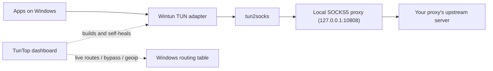

# TunTop

[](https://github.com/kooshaZP/TunTop/actions)
[](https://github.com/kooshaZP/TunTop/blob/main/LICENSE)
[](#requirements)
[](#requirements)
[](#features)

## Topics

`windows` · `vpn` · `proxy` · `socks5` · `tun2socks` · `wintun` · `full-tunnel` · `v2rayn` · `xray` · `sing-box` · `clash` · `vless` · `vmess` · `trojan` · `shadowsocks` · `geoip` · `dns-leak-protection` · `tui` · `dashboard` · `network-monitor` · `routing` · `privacy` · `censorship-circumvention` · `python`


**A Windows full-tunnel for any SOCKS5 proxy.**

v2rayN, Xray, sing-box, Clash Meta — any proxy client with a local SOCKS5 inbound works. TunTop gives you system-wide routing.

<p align="center">
  <br>
  
  
</p>

## Features

- IPv4 and IPv6 full-tunnel routing via Wintun + tun2socks
- **Real DNS-leak protection.** While a tunnel is up TunTop installs a
  catch-all Name Resolution Policy Table (NRPT) rule pinning every name to
  the tunnel resolvers, so Windows' Smart Multi-Homed Name Resolution can
  no longer ask a DHCP-assigned physical adapter's resolver in parallel and
  let the ISP answer (`.local` stays exempt for mDNS printers/NAS).
  The rule is **written before any old one is removed**, so a re-assert
  (self-heal, a live `[N]` change, a VPN-shadow pass) never opens a window in
  which no rule exists. A clean exit — stop, close, Ctrl-C — removes it, and
  a removal that cannot complete is reported as a failure and retried next
  launch rather than quietly forgotten. **A hard kill, a BSOD or a power cut
  do not**: the rule is a registry entry that survives reboots and points at
  a tunnel that is no longer there, which leaves the machine with no working
  name resolution. If that happens, run
  `python -m tuntop.ui.dashboard --remove-dns-guard` (see
  [Recovery](#if-something-goes-wrong)). Opt out with
  `--no-dns-guard` (the `[C]` row then reads "DISABLED by choice", not a
  failure); keep a LAN-only domain resolvable with
  `--dns-guard-exempt <domain>` — given as `corp.example` it exempts
  `corp.example` **and everything under it**, because exemption namespaces are
  normalised to NRPT's suffix-match form. Checked by the `[C]` row "DNS leak
  protection (catch-all NRPT rule)" and by `[L]` — which reports a confirmed
  `DNS leak` only when it can establish no catch-all rule is in force, and
  `unknown` (naming the adapters and why) when the guard state can't be read.
- DNS resolution fallback (UDP/53 + DoH) — and an optional
  `--dns-policy strict` that refuses to resolve outside a live tunnel
  instead of falling back. Wintun is also preferred as the OS DNS source
  (lowered interface metric) so a physical adapter's on-link resolver
  can't win; `[L]` proves nothing escapes.
- Optional adapter-activity logging (`--log-adapter-activity`) — UDP/QUIC
  connections, ICMP counter deltas and Wintun throughput deltas land in the
  structured event log (off by default; saved in your profile)
- **Kill-safe cleanup — a teardown that always finishes.** Each teardown
  phase is isolated, so one failing step cannot skip the rest (the isolation
  catches `KeyboardInterrupt` and `SystemExit` too, not just `Exception`, so
  a second Ctrl+C cannot abort a teardown already in progress). A re-entrancy
  latch inside `cleanup()` itself means a second teardown — from the signal
  handler *or* from `atexit` — cannot run a second full sweep over the route
  ledger. The geo install threads are cancelled **and joined** before the
  route ledger is snapshotted, and the ledger is rewritten *before* each
  gateway re-point installs its replacement routes, so a teardown racing a
  re-point can never leave live routes with no receipt. See
  [Correctness & limitations](#correctness--limitations) for what this does
  and does not cover.
- Live bypass add/remove without restarting the tunnel
- Geo-IP country routing from `geoip.dat`
- **Health monitoring with 46+ live checks** (route, DNS, leak, proxy, geo) —
  46 rows are always built; a bypass IP adds one row, each extra configured
  server adds three, and `--vless-over-vpn` adds one more.
  Checks are **tri-state**: `✔` verified, `✗` a real fault, and a grey `?`
  for "this probe could not answer" (no route to probe right now, an
  ICMP-filtered host, a DNS family you never configured). The `?` rows are
  counted separately as `n/a` and never drive the UNHEALTHY badge — a
  check that proved nothing is not a fault in your setup. The health panel
  title also shows the visible row range once the list is longer than the
  panel, so you can see there are more rows below.
- Self-healing — auto-restarts on tunnel failure, with a crash-loop
  backoff that genuinely escalates (a helper that keeps dying right after
  launch is caught instead of being reset to attempt 1 forever)
- btop-style dashboard with throughput graphs, 7 color themes
- Leak test, diagnostics export, profiles. **Crash logs and the `[D]`
  diagnostics export are written next to `TunTop.exe`**, so they survive
  the process (they used to land in the onefile extraction directory,
  which is deleted on exit — from the standalone exe, every crash report
  and diagnostics file was being lost).
- Protocol-agnostic — VLESS, VMess, Trojan, Shadowsocks, anything your
  client speaks; TunTop only needs its local SOCKS5 inbound
- Zero pip dependencies

## Why do I need this?

Most proxy setups only cover the browser. TunTop routes **every app** on your PC through your proxy — system-wide — and shows you exactly what's happening in a live dashboard. A dead tunnel is obvious at a glance instead of discovered mid-download.

## Quick start (30 seconds)

### 1. Clone

```powershell
git clone https://github.com/kooshaZP/TunTop.git
cd TunTop
```

### 2. Set up a proxy client

Install any SOCKS5-capable proxy client — e.g. [v2rayN](https://github.com/2dust/v2rayN), Xray, sing-box, or Clash Meta — and enable its local SOCKS inbound (default `127.0.0.1:10808`).

### 3. Set the server (the proxy origin)

TunTop also needs the address of your proxy's **origin server** — the remote
server your local proxy client (v2rayN, Xray, sing-box, ...) connects to.

**The protocol does not matter.** VLESS, VMess, Trojan, Shadowsocks, naive,
Reality, WS/gRPC transports — TunTop never talks to that server and never sees
your client's config. The only thing it consumes is the local SOCKS5 inbound
your client exposes; the origin address is needed for exactly one purpose: it
is the one address that must **NOT** go through the tunnel itself. TunTop
routes it around the TUN automatically, but you have to tell it where the
origin is. Pick **one** of these ways:

- **Edit `Run_Helper.ps1`** — set the `$Servers` line near the top:

  ```powershell
  $Servers = @('203.0.113.10')                    # a bare IP
  # $Servers = @('example.com')                   # or a hostname
  # $Servers = @('a.example.com', 'b.example.com') # multiple are fine
  ```

- **Command line** — `--server` is repeatable:

  ```powershell
  python -m tuntop.ui.dashboard --server 203.0.113.10 --server example.com
  ```

- **Live in the dashboard** — press `[U]` (Servers) and type the address(es),
  comma or space separated — or ADD them to the existing list. **A full share
  link works too**: pasting something like `vless://uuid@203.0.113.10:443?type=ws...`,
  `trojan://...`, `ss://...` or `https://example.com/...` is fine — TunTop
  strips the scheme, UUID/userinfo, port and path and keeps only the host,
  whatever the protocol. Changes made with `[U]` are resolved immediately and
  take effect on the next tunnel start (`[S]`).

**Why the origin never goes through the TUN:** for every address you list,
TunTop resolves it (both IPv4 and IPv6) and installs explicit host routes
(`/32` for IPv4, `/128` for IPv6) through the **physical NIC**. The tunnel's
own connection to the origin therefore always rides the real network and never
enters the TUN — otherwise the tunnel would try to reach its server through
itself (a routing loop) and nothing would connect. You can verify this in the
`[2]` panel: **SERVER / RESOLVED** on the *TUNNEL* side, and the same
addresses listed under **DIRECT** (what is routed around the tunnel).

> If your origin sits behind a CDN or reaches other domains, bypass those too:
> `--bypass-ip cdn.example.com` (repeatable) or press **[A]** in the dashboard
> and choose *direct* — same bypass mechanism, for any extra host.

### 4. Run

**Easiest — double-click `Start_TunTop.bat`.** It fixes the two classic
"downloaded from GitHub and it won't run" problems automatically (strips the
Mark-of-the-Web with `Unblock-File`, runs with `-ExecutionPolicy Bypass`),
styles the console (title, UTF-8, 120×36, TrueType font so the box glyphs
render), and starts `Run_Helper.ps1`.

> ⚠️ **Windows blocks `.ps1` scripts by default.** PowerShell's default
> execution policy is `Restricted`, and files downloaded from GitHub carry the
> Mark-of-the-Web, so double-clicking `Run_Helper.ps1` does nothing (or opens
> it in Notepad). Use **one** of these:
>
> - **`Start_TunTop.bat`** (recommended — fixes both blockers + styling)
> - **From a terminal** (also bypasses the policy):
>   ```powershell
>   powershell -ExecutionPolicy Bypass -File Run_Helper.ps1
>   ```
> - **From Explorer:** right-click `Run_Helper.ps1` → **Run with PowerShell**
>   → confirm the UAC prompt. (The script also unblocks itself and, if the
>   policy is `Restricted`, relaunches under `Bypass` on its own.)

Right-click `Run_Helper.ps1` → **Run with PowerShell** → confirm the UAC prompt. First run auto-downloads `tun2socks.exe` and `wintun.dll` if they're missing.

Press **[S]** to start the tunnel, **[C]** to run a health scan, **[L]** for a leak test.

### Running the standalone build (no Python needed)

1. **Download** `TunTop-<version>-x64-standalone.zip` (and `checksums.txt`)
   from the [latest release](https://github.com/kooshaZP/TunTop/releases/latest)
   and extract it to any folder — `Desktop\TunTop\` for example. The archive
   contains `TunTop\TunTop.exe` plus its support files; the exe already embeds
   `tun2socks` and `wintun.dll`, and Python is **not** required.
2. **(Optional) verify it:** `certutil -hashfile TunTop-<version>-x64-standalone.zip
   SHA256` and compare with `checksums.txt`. That is the one hash users can
   check directly — `checksums.txt` also carries a *content* digest for the
   extracted `TunTop/` folder, which is what the zip is made of.
3. **Run it:** double-click `TunTop\TunTop.exe` → confirm the **UAC prompt** (the
   dashboard manages routes and a TUN adapter, so admin is mandatory). A
   btop-style dashboard opens. Missing files are fetched automatically on
   first start (tun2socks / wintun if somehow absent, and the **geoip**
   database in the background — progress shows in the event log).
4. **Point it at your proxy** — the dashboard asks for a SOCKS5 inbound at
   `127.0.0.1:10808` (the v2rayN default). Start that proxy client first.
5. **Press `[S]`** — the tunnel comes up: Wintun adapter, routes, DNS. The
    header badge flips to **RUNNING**. Press **[C]** for a health scan and
    **[L]** for a leak test.

> **Why a zip and not a single exe?** Until 1.0.50 the release shipped one
> self-extracting `TunTop.exe`. That layout unpacks an unsigned payload to a
> temp directory on every start, which is the behaviour profile Defender's ML
> model keys on — a local 1.0.50 build was quarantined mid-session as
> `Trojan:Win32/Bearfoos.A!ml`, parent exe and four child processes. The
> folder layout is the same application with no self-extraction, so there is
> nothing to flag and no reason to add an antivirus exclusion. If you need a
> single file to hand around, `python build_release.py --with-exe --onefile`
> still builds the old one deliberately.

#### Changing servers and settings live (no restart)

The dashboard edits a RUNNING tunnel in place:

- **[U] Servers** — switch/add the proxy origin server live. You are prompted
  for the new list, then for addresses to add. The origin's protocol is
  irrelevant — only its host/IP is used.
- **[E] Endpoint** — change the endpoint port (e.g. 443) live.
- **[P] Port** — change the local SOCKS5 port live.
- **[N] DNS** — change the tunnel DNS servers live.
- **[A] / [X]** — add / remove a bypass IP instantly (route a site or server
  DIRECT, outside the tunnel) and choose the target: direct / proxy2 / VPN.
- **[F] Geo Manager** — country-level bypass: press **[W]** inside it to
  download/update the geoip database, then apply a country code (e.g. `cn`) so
  those sites route DIRECT while everything else stays in the tunnel.
- **[Z] Proxies** — add/change/remove a second proxy hop (proxy2) at runtime.
- **[V] / [Y]** — ride-another-VPN mode and its bypass list.
- **[O] / [I]** — save the whole setup to a profile / load it back.

Everything you change is logged in the event log panel (bottom). Press **[T]**
to stop the tunnel (routes are swept and verified), **[Q]** to quit.

> The exe requests the **Cascadia Mono SemiLight** font at startup so the
> box-drawing glyphs render. If your console ignores it and you see
> `???????????`, see [Troubleshooting](#troubleshooting) for the
> right-click → Properties → Font fix.

## How it works


```mermaid
flowchart LR
    A[Apps on Windows] --> B[Wintun TUN adapter]
    B --> C[tun2socks]
    C --> D["Local SOCKS5 proxy (127.0.0.1:10808)"]
    D --> E[Your proxy's upstream server]
    F[TunTop dashboard] -. builds and self-heals .-> B
    F -. live routes / bypass / geoip .-> G[Windows routing table]
```

TunTop builds a Wintun TUN adapter, feeds it through `tun2socks` into your proxy's local SOCKS5 inbound, and manages the Windows routing table to direct all traffic through it. The dashboard owns the tunnel for its entire lifetime — editing servers, bypass rules, or geo splits updates the routing table live.

## Key reference

| Key                           | Action                                               |
| ------------------------------ | ----------------------------------------------------- |
| `[S]` `[T]` `[Q]`             | Start / stop / quit (verifies cleanup)                |
| `[C]`                         | Health scan                                           |
| `[A]` `[X]`                   | Add/remove bypass instantly, with target choice: direct / proxy2 / vpn (no restart) |
| `[L]` `[D]`                   | Leak test / export diagnostics                        |
| `[O]` `[I]`                   | Save / load profile                                   |
| `[U]` `[V]` `[Y]` `[F]`       | Servers (live) / VPN mode / VPN bypass / geo manager (apply · change · remove, live) |
| `[Z]`                         | Add/change/remove the second proxy (proxy2) at runtime |
| `[P]` `[N]` `[E]`             | SOCKS port / DNS (live, no restart) / endpoint port (live) |
| `[R]`                         | Re-apply geoip country bypass live                    |
| `[G]` `[M]` `[H]`             | Graph mode / theme / help show-hide                   |
| `1-6`, `0`                    | Hide/show panels                                      |
| `j`/`k` / arrows / PgUp / wheel / ←→ | Scroll: hovering a panel makes it the ACTIVE target for j/k, arrows, PgUp/PgDn, Home/End, ←/→ and the wheel |

On short windows (16:9 screens) the panels shrink first — health-check rows,
then the graph — and the help footer is only removed as the last resort.

## Requirements

| What                  | Why                         |
| --------------------- | ---------------------------- |
| Windows 10 1803+ / 11 | Wintun adapter driver         |
| Python 3.10+          | stdlib only, no pip install   |
| Administrator         | route table management        |
| A SOCKS5 proxy client (v2rayN, Xray, sing-box, Clash Meta, ...) running locally | provides the SOCKS5 inbound |

## Trust & packaging (the honest version)

TunTop is a single-maintainer project. Here is exactly what you are accepting
when you run it, and what has / has not been verified:

- **The exe is unsigned.** It requires Administrator and rewrites the routing
  table — a behaviour profile AV/ML models flag, which is why the release ships
  the **folder** build rather than a self-extracting single exe (see *Why a zip
  and not a single exe?* above). We make **no claim** that antivirus false
  positives are resolved; they may still occur. The `TunTop-x64.zip` / source
  route avoids a frozen build entirely: run from source with Python, or use the
  zip instead of the standalone build if your AV is aggressive. **We do not
  recommend adding an antivirus exclusion** — a folder exclusion stops
  Defender watching every future file written under it, and this is a tool that
  rewrites the host's routing table and DNS.
- **What you CAN verify:** every published release ships `checksums.txt`; the
  CI workflow builds the exe from the tagged commit and the SHA-256 you
  compute locally (`certutil -hashfile TunTop-<version>-x64-standalone.zip
  SHA256`) proves the bytes match what CI produced. That proves integrity (no
  tampering in transit), **not** safety — the difference matters.
- **Auto-download trust model:** the vendored `tun2socks.exe` / `wintun.dll`
  are checked against SHA-256 pins that live IN THE REPO
  (`tuntop/core/integrity.py`) — the expected hash does not come from the
  download channel, so a compromised mirror cannot swap the binary. The
  `geoip.dat` auto-update is weaker by design: its checksum comes from the
  same v2fly GitHub release as the file itself (trust-on-first-use).
  A hostile source could serve a wrong geo database — it could not achieve
  code execution, but it could route countries incorrectly; pin/ship your
  own `geoip.dat` if that threat matters to you.
- **What a hostile `geoip.dat` CAN and CANNOT do**: a geo
  database is data, never code. The decoded-CIDR cache the helper writes
  next to the install used to be a `pickle`, which is a deserialization
  primitive — any unprivileged process able to write next to the install
  would have gained code execution in the **elevated** helper on the next
  `[S]`. It is now plain JSON, and re-validated on read: every CIDR passes
  through the same normaliser the decoders use, which parses it, canonicalises
  it, and **refuses anything at or above a per-family prefix floor** (`/8` for
  IPv4, `/16` for IPv6). That floor is the real rule — a range this broad
  installed at `metric=1` is more specific than TunTop's own `0/0` + `/1`
  (and `::/0` + `::/1` + `8000::/1`) split-defaults, so it would capture
  *every* packet bound outside the tunnel. Before the floor existed, the
  only protection was a six-string literal list, and `2000::/3` (the whole
  IPv6 global-unicast space) sailed through it. The floor is enforced twice on
  purpose — once when parsing, once at the install boundary — and
  `tests/unit/test_correctness_pass.py` pins the two to the same values so
  they cannot drift apart again. A tampered database can still misroute
  traffic, but it cannot silently capture your whole connection and it
  cannot take over the process.
- **The auto-updater's transport is pinned.** Release checks use TLS 1.2+
  with hostname verification, and every request — *including each redirect
  hop* — must stay on GitHub's own hosts. The release metadata, the exe and
  its `checksums.txt` all go through the same allow-list, so a redirect
  cannot substitute an artifact (and cannot substitute the checksum that
  "verifies" it). A non-200 response is reported with its status code and is
  never reported as "offline". **The `[W]` geo-database download now uses the
  same transport** (TLS floor, per-hop host allow-list, 64 MB cap) — it
  previously used a bare `urlopen` with none of the three, which is why the
  geo data was the one download with a weaker guarantee than the exe. It also
  **fails closed** by default: if the release's `.sha256sum` cannot be
  fetched or does not parse, the database is *not* installed. Pass
  `strict_checksum=False` to `download_geoip()` to opt back into
  trust-on-first-use.
- **What TunTop will never touch:** TunTop deletes routes it can attribute to
  itself. Same-prefix routes on adapters outside its own scope are treated as
  foreign and left alone, the crash sweeps re-check the session marker
  (and its PID's liveness) immediately before the first destructive step, and
  `tun2socks` processes are only ever killed when the binary is either one
  this session spawned, the exact configured path, or the vendored filename
  **in a directory TunTop put it in** — the vendored name is also the
  upstream tun2socks release asset name, so a bare name match is not proof
  of ownership.
- **Battle-testing:** the automation suite (see [Tests](#tests)) runs on every push, but
  real-world exposure is still low — few outside users, no broad hardware /
  network matrix coverage beyond the
  [test matrix](docs/TEST-MATRIX.md). If you rely on it, read the routing
  code (`tuntop/network/routing.py`, `tuntop/core/cleanup_watchdog.py`) — it
  is written to be auditable on purpose.
- **Release hygiene:** version metadata drift has happened before (1.0.14
  shipped with exe properties saying 1.0.13 - fixed in 253f373, and the
  same class was caught AGAIN pre-release in 1.0.19). It is now enforced,
  not promised: `tests/unit/test_release_hygiene.py` fails the suite (and
  therefore CI) if `tuntop_version_info.txt`, `tuntop/__init__.py` and
  `CHANGELOG.md` disagree. Bug-class repeats are documented in the
  [changelog](CHANGELOG.md) rather than hidden.

## Correctness & limitations

This section is a register, not marketing. Each row is a behaviour this project
*depends on*, whether it is actually enforced today, and where. If a row says
**not enforced**, treat it as a thing to verify yourself before relying on it.

The guiding rule, applied to every sentence in this file: **never write an
intended behaviour in the voice of a delivered one.**

| Behaviour you can rely on | Status | Enforced in | If it fails |
|---|---|---|---|
| A clean exit (`[T]`, `[Q]`, Ctrl-C) removes every route TunTop installed | verified | `helper.cleanup()`; bulk `netsh -f` deletion | `[Q]` prints the verified route count; startup recovery sweeps the next launch |
| A teardown already in progress is not aborted by a second Ctrl+C | verified | `helper._step` catches `KeyboardInterrupt`/`SystemExit`; `cleanup()` latches re-entrance | — |
| Geo install threads are joined before the route ledger is snapshotted | verified | `helper._stop_geo_installer` escalates 30s → 120s and says so if it gives up | a loud `[!] geo thread did not stop` line names the risk |
| Every geo route has a ledger receipt, even if a teardown races a gateway re-point | verified | registration happens *before* install in both the install and re-point paths | a partial re-point rolls back its own receipts and keeps the originals |
| A geo CIDR can never be a default route | verified | prefix floor `/8` v4, `/16` v6 — at parse time *and* at the install boundary | broad ranges are dropped and logged, not installed |
| A hostile `geoip.dat` cannot execute code | verified | cache is JSON, never pickle; re-validated on every read | — |
| DNS leak guard removed on a clean exit | verified | `cleanup()` phase ordering; failures reported and retried next launch | `[!] DNS leak guard removal failed` names the locked state |
| DNS leak guard removed after a **crash / BSOD / power loss** | verified | a one-shot `AtStartup` Task Scheduler task (`TunTop-DnsGuard-Removal`, SYSTEM/Highest) armed by `install()` **before** the rule is written; it runs as SYSTEM before any logon, clears the rule, the record and the cache, then deletes itself | if the task could not be armed, the `[C]` row says **NOT crash-safe**; run `--remove-dns-guard` |
| DNS leak guard never has a window with no rule | verified | the catch-all's five values are written **in place** — `New-Item -Force` opens the key, so the rule is never absent; a partial write keeps the previous (still-tunnel) server list | — |
| `--dns-guard-exempt corp.example` exempts the whole subtree | verified | namespaces normalised to NRPT suffix-match form | — |
| A second `[T]` press does not start a second teardown | verified | the teardown is claimed on the UI thread before the worker spawns | — |
| A start never launches a second helper | verified | `_managed_start` checks `self.proc` before the force-reset | — |
| `[Q]` cannot report "routes cleared" while a resolver is still installing | verified | writers quiesced, then a final ledger flush, then the count | — |
| A VPN's own routes are restored after a `[V]` toggle or an exit | verified | `_raw_add_route` normalises the on-link next hop and stores persistently | — |
| VPN-override shadows never survive a reboot | verified | `store=active` on every install (netsh defaults to *persistent*) | a pre-1.0.48 leftover is removed by the next clean exit |
| Geo data is verified before it is installed | verified | SHA-256 mismatch **and** an unreachable checksum both refuse | pass `strict_checksum=False` to opt out |
| No `//` in any embedded PowerShell | verified | `tests/unit/test_correctness_pass.py` scans the generated scripts | CI fails |
| Probe timeouts are real | verified | explicit `shutdown(wait=False)`; a `with` block would void them | — |
| DNS server registration is confirmed, not assumed | verified | DoH registration re-reads the OS list; `-ErrorAction SilentlyContinue` no longer hides failure | the dashboard shows the real state |

### Windows-only caveats

These cannot be covered by the CI matrix and are worth knowing:

- **On-link IPv6 defaults** report `NextHop = "::"`, which `netsh` rejects as a
  token. TunTop normalises it to `""` everywhere it compares, stores or deletes
  a route. A third-party script reading the route table directly must do the same.
- **`CTRL_CLOSE_EVENT` is not handled.** Closing the console window with the X
  button kills the process without running a teardown. Use `[Q]` instead.
- **`netsh` output is localised.** The geo installer's progress counter parses
  English success lines, so on a non-English Windows the *progress display* is
  unreliable — the routes themselves install correctly.
- **Administrator really is required.** TunTop rewrites the machine routing
  table; launch it with `Start_TunTop.bat` (or `Run_Helper.ps1`).
- **The boot cleanup task needs Task Scheduler.** `TunTop-DnsGuard-Removal` is
  registered as a scheduled task, so a machine (or a policy) with Task Scheduler
  disabled gets no crash protection — and the `[C]` row says **NOT crash-safe**
  rather than leaving you to find out. `--remove-dns-guard` is the manual path.
  The task is registered *while the rule is live* and deletes itself at the
  first boot that follows, so it never outlives the guard; `Get-ScheduledTask
  -TaskName TunTop-DnsGuard-Removal` should show nothing on a machine that was
  cleanly shut down.
- **A VPN with a private `ServerAddress` hostname still needs an exemption.**
  TunTop resolves the gateway through the physical adapter, so the *bypass route*
  is right. But the *Windows VPN client* resolves that name through the system
  resolver, and the catch-all DNS guard owns the system resolver while the
  tunnel is up. Pass `--dns-guard-exempt corp.example` for a private corporate
  domain. A public FQDN needs nothing.

## If something goes wrong

The failure most likely to leave your machine unusable is a hard kill (BSOD,
power loss, *End Task* in Task Manager) while a tunnel is up: the DNS
leak-protection rule survives as a registry entry and keeps every name pointed
at a resolver that no longer answers.

**Since 1.0.51 that self-heals.** While the rule is installed, TunTop registers
a one-shot scheduled task `TunTop-DnsGuard-Removal` that runs as SYSTEM at the
next startup — before anyone logs in — removes the rule, the install record and
the DNS cache, and then deletes itself. You do not have to do anything; the
machine is already fixed by the time you sit down at it.

You only need the manual path when the task could not be armed, which the `[C]`
health row tells you plainly (**"NOT crash-safe"**) and `[D]` confirms:

```powershell
# From an Administrator PowerShell, in the repo folder. Removes TunTop's NRPT
# rules, its install record AND its boot cleanup task, then exits. Use the
# MODULE form - `python tuntop/ui/dashboard.py` puts tuntop/ui/ on sys.path
# and dies with "No module named 'tuntop'".
python -m tuntop.ui.dashboard --remove-dns-guard
ipconfig /flushdns

# Same thing for the standalone build, from the folder holding TunTop.exe:
#   .\TunTop.exe --remove-dns-guard
```

The flag confirms the removal against the OS rather than trusting the command's
own exit status, and tells you if a catch-all rule is *still* in force — which
would then be a company GPO rule rather than ours. Check with
`Get-DnsClientNrptPolicy -Effective`.

| Symptom | Cause | What to do |
|---|---|---|
| No name resolution after a crash or reboot | a boot cleanup task that could not be armed (the `[C]` row said NOT crash-safe) | `python -m tuntop.ui.dashboard --remove-dns-guard` (or `.\TunTop.exe --remove-dns-guard`) |
| A Windows VPN refuses to connect while the tunnel is up | the VPN's gateway has no bypass, so the handshake is captured by the TUN | restart the tunnel; 1.0.51 arms a pre-connect bypass for every configured profile. If its `ServerAddress` is a **private hostname**, add `--dns-guard-exempt <your-corp-domain>` — the Windows VPN client resolves it through the guard |
| Dashboard will not start, claims another instance is running | stale single-instance lock after a kill | close any `TunTop`/`tun2socks` process, then relaunch |
| Tunnel up but every app is dead | the origin server's route was captured by the TUN | `[T]` then `[S]`; the `[L]` row names the endpoint |
| Some sites work and others don't after connecting a VPN | split-tunnel conflict | `[T]`, connect the VPN, then `[S]` — or use `[V]` |
| `[A]` bypass installed but the host is still unreachable | the proxy client resolves it differently | the health row shows the resolved addresses; use `[X]` to remove and retry |

## Project layout

```
Run_Helper.ps1            <- launcher (PowerShell)
tuntop/
  core/                    <- state, recovery, route transactions, startup
                             recovery, integrity, events (see the note below)
    tunnel_manager.py      <- lifecycle facade (start/stop/recover)
    state.py               <- tunnel state machine
    recovery.py            <- backoff-based recovery engine
    routes_txn.py          <- transactional route management
    startup_recovery.py    <- crash detection + cleanup at launch
    integrity.py           <- binary SHA-256 verification
    events.py              <- structured logging
  network/                 <- routing / DNS / egress selection (Windows edge)
    routing.py             <- netsh/PowerShell route engine + VPN coexistence
    dns.py                 <- DNS resolver with cache
    dns_guard.py           <- catch-all NRPT DNS pin (leak protection)
    egress_scripts.py      <- TUN-interface / egress PowerShell snippets
    procguard.py           <- may kill tun2socks only when TunTop owns it
    routeops/              <- bulk route sweeps
  tunnel/                  <- Wintun + tun2socks (Windows edge)
    helper.py              <- tunnel builder + self-heal monitor; owns the
                              Wintun adapter, the tun2socks process and the
                              VPN shadow routes
    exec.py                <- child-process spawning helpers
  monitor/                 <- health / traffic / leak / diagnostics
    health.py              <- visual health report
    traffic.py             <- live traffic stats
  config/                  <- profiles + models + defaults
    profiles.py            <- profile save/load + protected secrets
  geo/                     <- geoip.dat parser
    geoip.py
  ui/                      <- btop-style dashboard (owns the tunnel)
    dashboard.py
    themes.py              <- terminal text/layout primitives
tests/                     <- test suite across 5 tiers (count via: python -m unittest discover -s tests -t .)
```

**The layering above is aspirational, not enforced.** `tuntop/__init__.py`
describes the intended flow as `UI -> Core -> Network/Tunnel -> Windows`, and
`core/tunnel_manager.py` is a real facade - but `tuntop/ui/dashboard.py` does
not respect it. It reaches `tuntop.core.*` for only two things,
`tunnel_manager` and `markers`; everything else comes in through twelve legacy
top-level shims (`tuntop.routing`, `tuntop.state`, `tuntop.recovery`,
`tuntop.routes_txn`, `tuntop.startup_recovery`, `tuntop.integrity`,
`tuntop.profiles`, `tuntop.netdns`, `tuntop.psshell`, `tuntop.ui_text`,
`tuntop.structured_log`, `tuntop.health_report`) plus six direct imports of the
leaf packages (`tuntop.network.egress_scripts`, `tuntop.network.routeops`,
`tuntop.network.procguard`, `tuntop.network.dns_guard`,
`tuntop.config.defaults`, `tuntop.monitor.leak`). `tuntop.geo.geoip` and
`tuntop.config.updates` are imported lazily, inside functions.

The shims are not duplicate code - each one does
`sys.modules[__name__] = <the real module>`, so the names above are the very
same objects as `core/`/`network/`/`monitor/`. What is missing is the
*boundary*, not the indirection: `core/` is where new orchestration logic is
meant to live, but nothing stops the UI from reaching around it, and today
it routinely does. Do not read the table above as a one-way dependency you
can rely on when adding code.

`tun2socks.exe` and `wintun.dll` are auto-downloaded on first run and not in the repo.

## Troubleshooting

- **Dashboard won't start** — TunTop needs Administrator rights. Right-click `Run_Helper.ps1` → Run as Administrator.
- **Page renders wrong — lots of `???????????` instead of the boxes/panels** — the
  console font can't draw the Unicode glyphs. Fix: **right-click the title bar at
  the top of the console window → Properties → Font tab**, and switch the font to
  a TrueType mono font — **Cascadia Mono**, **Cascadia Mono SemiLight** (the
  default TunTop requests), **Consolas**, or **Lucida Console**. Raster fonts
  (the default on some systems) simply have no glyphs for those characters.
  Also make sure the codepage is UTF-8: `chcp 65001`. Then restart TunTop.
- **Health scan fails** — press `[D]` to export diagnostics (config, routes, logs, last scan) and attach it to an issue.
- **Traffic leaks** — run `[L]` to compare direct vs tunneled exit IP, and confirm v2rayN's SOCKS5 inbound is listening on the port TunTop uses (`[P]`).
- **Tunnel starts but nothing connects** — check the `SERVER`/`RESOLVED` rows in the `[2]` panel: the origin must resolve and be listed under **DIRECT**. See *Set the server (the proxy origin)* above; if the origin is behind a CDN, bypass that domain too (`[A]` → direct).
- **Running alongside another VPN** — use VPN mode (`[V]`) and VPN bypass (`[Y]`) so TunTop rides the existing VPN instead of fighting for the default route.
- **The badge says UNHEALTHY but every listed row is green** — look for a grey
  `?` row and the `n/a` count in the health-panel title. Those are probes that
  could not answer, not faults. If one of them is a DNS row, it is almost
  always a resolver family you never configured: set one with `[N]`, or ignore
  it. Press `[C]` to rescan.
- **A health row is cut off / you cannot see the failing row** — the health
  panel title now shows `(from-to of N)` once the list is longer than the
  panel. Scroll with the mouse wheel or `j`/`k` after hovering it, and
  `<`/`End` to jump back to the newest row.
- **I launched TunTop twice by accident** — the second window now detects that
  the first one's session is still live and leaves its tunnel, routes and DNS
  guard **completely alone** (it says so in the log). Close the first window
  before starting a second one; they do not share a tunnel.
- **A geo country is not being bypassed (IPv6 especially)** — press `[D]` and
  check the `GEO BYPASS` section. Since 1.0.41 the CIDR comparison is
  canonical on both sides, so IPv6 country ranges are matched and swept
  correctly; an older build could leave them installed and unswept.
- **A geo removal says some routes could not be removed** — that is now the
  honest report: the count is verified against the routing table, so the
  remainder are still in it (denied, in use, or re-added by Windows). Those
  destinations may still follow the old bypass until the next full restart.
- **Still stuck?** Open an issue and attach the diagnostics file from `[D]`. See also [FAQ](FAQ.md).

## Tests

Pure-stdlib test suite, runnable on any OS with no admin rights. The exact
count changes with every release — the command below prints it:

```bash
# Run the full suite (what CI runs)
python -m unittest discover -s tests -t . -v

# Including live-network tests (needs Internet)
TUNTOP_NET_TESTS=1 python -m unittest discover -s tests -t . -v
```

See `tests/README.md` for the tier layout (unit / routing / recovery / integration / network).

CI runs the suite on **Ubuntu and Windows** (the Windows-only tests skip
themselves on Linux via `skipUnless(os.name == "nt")`) plus `ruff` and
`bandit`. Those are not decoration — every medium-tier defect fixed in
1.0.48 (an undefined `vk` at module scope that raised `NameError` on every
run, unused `global` statements, dead locals, a function call in an
argument default) is something `ruff` catches on the first pass. The rule
set is deliberately narrow; see `ruff.toml` for what is enabled and why.

## Contributing

See [CONTRIBUTING.md](https://github.com/kooshaZP/TunTop/blob/main/CONTRIBUTING.md). Short version:

- **Standard library only** — no new pip dependencies without discussing in an issue.
- **The UI must never block** — DNS, PowerShell, and route operations belong on background threads.
- **Cleanup is sacred** — anything that adds routes must be removable at exit.
- Run tests before committing. Include diagnostics (`[D]`) with bug reports.

## Project docs & roadmap

- [MILESTONE-v1.0.md](docs/MILESTONE-v1.0.md) — feature freeze, the definition of "stable", and the v1.0 criteria
- [TEST-MATRIX.md](docs/TEST-MATRIX.md) — Windows 10/11 · Wi-Fi/Ethernet · VPN-active · IPv4/IPv6 · DNS-failure · sleep/wake test matrix
- [KNOWN-ISSUES.md](docs/KNOWN-ISSUES.md) — known bugs and edge-case register
- [CHANGELOG.md](CHANGELOG.md) — release history
- [FAQ.md](FAQ.md) — common questions and answers

## Acknowledgments

TunTop builds on:

- [v2rayN](https://github.com/2dust/v2rayN) — proxy client with a local SOCKS5 inbound
- [tun2socks](https://github.com/xjasonlyu/tun2socks) — TUN-to-SOCKS translation
- [Wintun](https://www.wintun.net/) — Windows TUN adapter driver
- [btop](https://github.com/aristocratos/btop) — dashboard visual inspiration

## License

[MIT](https://github.com/kooshaZP/TunTop/blob/main/LICENSE)
